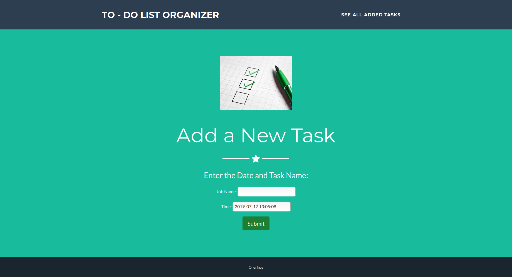
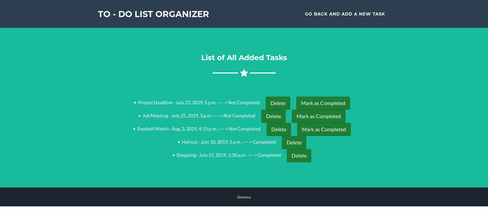

# django-todolist

Simple to-do list application made in Django framework using sqllite3 database.

**Application has two pages :**

- Adding a new job to list with DateTimeField

- Listing all current jobs (sorted by completion status and date)

In second page, it is also possible to mark job as completed or delete it completely. 
